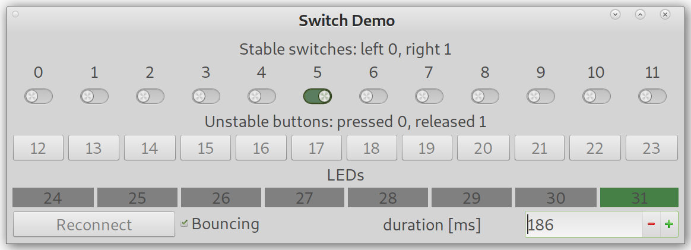

# BR_Internet_Radio
This is a simple Internet radio built using mpd/mpc and Flask with Buildroot.
Please note, that this repository contains also sources taken from python-mpd2 project ( https://github.com/Mic92/python-mpd2 ) and flask-wtf project ( https://github.com/lepture/flask-wtf ).

It has been developed for Orange Pi Zero board, but testing was also performed in
virtual machines (Virt 64 and Vexpress-A9) emulated in QEMU.

The version developed in the "gpio" branch offers a possibility to connect one 32-bit GPIO port of the emulated
Vexpress-A9 machine to the GUI simulating 12 switches, 12 buttons and 8 diodes.



This allows you to add a control interface to the Internet radio. The GUI is even capable to simulate the bouncing effect in buttons and switches, do you can test if your firmware handles it properly before moving to the real hardware.

Please be aware of one problem. Due to the fact how the original mpc8xxx model is implemented, the first writing to the emulated output does not trigger sending a message to the GUI. So at the begining you must initialize the outputs twice. Afterwards they work correctly. Unfortunately, I was not able to fix it in an easy way. I'f you know how to fix it, please do that and send me the merge request.

## Building
To build the Linux image, enter the appropriate directory and run the "build.sh" script.
It should automatically download the buildroot, unpack it, configure and build the image.

Compilation of the "gpio" branch requires that you have developer packages for alsa library (`libasound2-dev` for Debian-based distributions, `alsa-lib-devel` for RedHat-based distributions etc.) and pulseaudio library (`libpulse-dev` for Debian-based distributions, `pulseaudio-libs-devel` for RedHat-based distributions etc.)

## Running
In case of the real hardware (currently only Orange Pi Zero), you should transfer
the compiled files to the SD card. You may simply write the generated sdcard.img
to the card using `dd` tool.
### Simplified update for Orange Pi Zero
When updating the image, I usually simply copy the "zImage", "sun8i-h2-plus-orangepi-zero.dtb", and "boot.scr"
files from output/images directory to the first partition of the SD card, and unpack the output/images/rootfs.ext4 
file to the second partition (after erasing it first). That procedure leaves the "u-boot-sunxi-with-spl.bin"
loader not updated, but that's usually not a problem.
Of course you may update it using the `dd` tool (replace /dev/sdX with the name of the device corresponding to your SD card):

```
dd if=u-boot-sunxi-with-spl.bin of=/dev/sdX bs=1024 seek=8
```


### Running in virtual machine
To test your radio in a virtual machine, run the "runme" file in the appropriate directory.

## Using
After the machine starts, the radio should start playing the first station.
You may control the radio via simplistic web interface available on the 8810 TCP port.
In case of the virtual machines it is forwarded to the 8888 port on the host machine.

## Porting to another board
If you want to port that project to another BR-supported board, you should prepare the Buildroot configuration.
You should start with `make yourboard-defconfig` and then enter the appropriate modifications:

* Change the toolchain to external one.
* Set the root password (in my configurations it is set to "MyRootPassword" of course you should change it).
* Select /dev management (Dynamic using devtmpfs + eudev).
* Select `alsa-utils` and inside: `alsamixer` and `speaker-test`
* Configure rootfs overlay directories: `../../common_overlay ../overlay`.
  * When your virtual machine boots, you may produce the `asound.state` file using the command 
    `/usr/sbin/alsactl --file /tmp/asound.state store`. That file should be copied via SSH to the host and stored as
    `../overlay/root/.config/asound.state`
* Select `dropbear` package.
* Select `mpd` package and its appropriate options:
  * select the `curl` input plugin
  * select converter plugins
  * select decoder plugins (I've selected all except `tremor`).
* Select `Python3` and its modules:
  * internal modules: `readline`,`ssl`,`sqlite`,`zlib`, `xml`, `xz`
  * external modules: `python-flask`, `python-flask-babel`, `python-flask-login`, `python-wtforms`, `websockets`
* Select `ifplugd`
* Select `screen`

  
